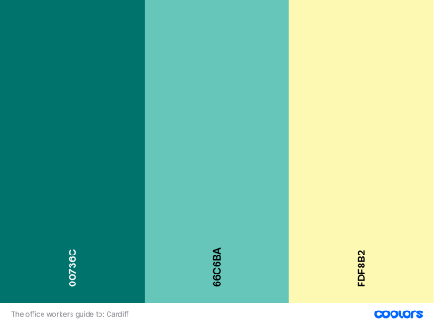

# The office workers guide to: Cardiff

The Office Worker's Guide to: Cardiff aims to inform and assist new and returning office workers in navigating their work experience in Cardiff, Wales. The website will serve as a valuable, reliable and  comprehensive resource by providing relevant information about various aspects of working in the city, including travel options, dining recommendations, nearby gyms, parks, and events. This will allow office workers to navigate their work experience in Cardiff with ease, make informed decisions, and ultimately enhance their overall quality of life in the city.

Images of finished site
Link to live project
***
## Contents
- [The office workers guide to: Cardiff](#the-office-workers-guide-to-cardiff)
  - [Contents](#contents)
  - [User Stories](#user-stories)
      - [New User](#new-user)
      - [Returning User](#returning-user)
      - [Returning User - Future Functionality](#returning-user---future-functionality)
  - [User Flows](#user-flows)
      - [New User](#new-user-1)
      - [Returning User](#returning-user-1)
  - [Features](#features)
    - [Existing Features](#existing-features)
    - [Future Features](#future-features)
    - [Accessibility](#accessibility)
  - [Typography and Color Scheme](#typography-and-color-scheme)
    - [Typography](#typography)
    - [Color Scheme](#color-scheme)
  - [Wireframes](#wireframes)
  - [Technology](#technology)
    - [Languages Used](#languages-used)
    - [Frameworks, Libraries \& Programs Used](#frameworks-libraries--programs-used)
  - [Testing](#testing)
    - [Code Validation (HTML)](#code-validation-html)
    - [Code Validation (CSS)](#code-validation-css)
    - [Lighthouse](#lighthouse)
    - [Bug Fixes](#bug-fixes)
    - [Supported screens and Browsers](#supported-screens-and-browsers)
    - [Testing User Stories](#testing-user-stories)
  - [Deployment](#deployment)
  - [Credits](#credits)
    - [Code](#code)
    - [Text, Images \& Media](#text-images--media)
***
## User Stories
#### New User
1. As a new office worker in Cardiff I want a website that is clear and well organized.
2. As a new office worker in Cardiff I want all aspects of the website to be fully functional. 
3. As a new office worker in Cardiff I want to find out which mode of transport is suitable for me.
4. As a new office worker in Cardiff I want to find out what the city looks like.
5. As a new office worker in Cardiff I want to be able to find information about other facilities in the city.
6. As a new business in Cardiff I would like to advertise on the website.
#### Returning User
1. As an office worker in Cardiff I want to be able to find alternative modes of transport should my usual mode not be available.
2. As an office worker in Cardiff I want to find new places to take lunch.
3. As an office worker in Cardiff I would like the information supplied to be accurate with an option to feedback any incorrect information.
4. As an office worker in Cardiff I would like to be able to quickly navigate through the website. 
#### Returning User - Future Functionality
1. As an office worker in cardiff I would like real-time notifications about disruption to public transport in the city.
2. As an office worker in cardiff I would like discount codes and offers from businesses around the city.
3. As an office worker in Cardiff I would like to know what events are upcoming. 
4. As an office worker in cardiff I would like real-time notifications about available car parking spaces.
5. As a business in Cardiff I would like to be able to communicate directly with my customers. 
## User Flows
#### New User

#### Returning User

***
## Features
This project is designed to provide an informative and useful resource to office workers.
### Existing Features
 1. Information Hub: Develop a user-friendly website that serves as a centralized hub for office workers to access essential information about working in Cardiff. The website will feature well-organized sections covering travel, lunch options, nearby gyms, parks, and upcoming events.
 2. Travel Information: Provide details on transportation options, including train and bus times, to help office workers plan their daily commute effectively. 
 3. Lunch Recommendations: Curate a comprehensive list of nearby restaurants, cafes, and food outlets that offer a diverse range of options for office workers to enjoy during their lunch breaks.
 4. Fitness Facilities: Compile a list of nearby gyms and fitness centre's in Cardiff, along with relevant details such as membership fees, facilities, and opening hours. Provide office workers with the necessary information to maintain a healthy lifestyle and incorporate exercise into their daily routines.
### Future Features
1. Future Pages:  This will include a Parks and Recreation page which will highlight local parks, green spaces, and recreational areas in Cardiff, providing office workers with opportunities to unwind, relax, and engage in outdoor activities during their leisure time. Include relevant details such as park amenities, accessibility, and popular activities.
2. Future Integration: Plan and implement additional features for the website, such as , discount codes for various services and products, and other relevant functionalities that enhance the user experience and support the needs of office workers. 
    ##### Other relevant functionalities: 
    1. Integrating real-time data and notifications will be a key feature to assist users in staying informed about any changes or disruptions in public transportation.
    2. Research feasibility and if feasible implement real-time availability of car park spaces around the city.
    3. Incorporate user reviews, ratings, and interactive maps to facilitate decision-making and enhance the overall user experience to the lunch recommendations section.
    4. Feature a regularly updated calendar of events, exhibitions, conferences, and other notable activities taking place in Cardiff. Provide office workers with a comprehensive overview of cultural, social, and professional events in the city to encourage engagement and networking opportunities.
    5. Create a feature where businesses and customers can communicate directly. 

### Accessibility
To enhance visibility for individuals with visual impairments, I have selected color palettes that offer contrast. This deliberate choice enables better readability and comprehension of the content. Additionally, I have taken great care to provide descriptive alternative text for all images used on the website. This inclusion allows screen readers to accurately convey the visual information to users who rely on auditory assistance. Furthermore, I have ensured the accessibility of interactive elements by labelling all links and form elements appropriately.  
***
## Typography and Color Scheme
### Typography
For the body of the website, the elegant and legible Source Sans Pro font has been selected from Google Fonts. Its refined and modern appearance enhances the overall aesthetic while maintaining readability across various devices and screen sizes.

To ensure consistent rendering across platforms, Arial has been chosen as the Web-safe font. This familiar typeface acts as a reliable fallback option, ensuring that the content remains accessible even if the users device does not support the preferred font.

In situations where both Source Sans Pro and Arial are unavailable, the browser will default to the Sans-Serif font family, ensuring that the text remains clear and easily readable. 

The Signika Negative has been used when creating the logo. The Courgette font is used within the main heading creating a balanced and visually engaging look that enhances the overall design of the website. 

By utilizing these fonts strategically, the project achieves a distinct and memorable brand identity. 
### Color Scheme
In this project, the color palette has been selected to achieve a modern and clean aesthetic that is both visually pleasing and aligned with the preferences of the target audience.

***
## Wireframes
During the coding process for the desktop home page, I encountered a challenge while attempting to accommodate all of the necessary information on the screen, as depicted in the corresponding wireframe. It was at this point that I realized I had inadvertently modified the size of the desktop wireframe template, this granted me additional screen space within the wireframe. Consequently, I had to reconsider my design approach for the desktop version, aiming to enhance its flow and generate more vertical space to accommodate the content more effectively. This adjustment allowed me to create a more cohesive and user-friendly desktop layout.

[Mobile Home Page](resources/mobile-home-page.png)  
[Mobile Travel Page 1](resources/mobile-travel-page.png)  
[Mobile Travel Page 2](resources/mobile-travel-page-2.png)  
[Mobile Lunch Page 1](resources/mobile-lunch-page.png)  
[Mobile Lunch Page 2](resources/mobile-lunch-page-2.png)  
[Mobile Fitness Page](resources/mobile-fitness-page.png)  
[Mobile Gallery Page](resources/mobile-gallery-page.png)    
[Mobile Feedback Page](resources/mobile-feedback-page.png)      
[Mobile Thank You Page](resources/mobile-thank-you-page.png)            
[Mobile 404 Page](resources/mobile-404-page.png)      
[Tablet Home Page](resources/tablet-home-page.png)  
[Tablet Travel Page](resources/tablet-travel-page.png)  
[Tablet Lunch Page 1](resources/tablet-lunch-page.png)  
[Tablet Lunch Page 2](resources/tablet-lunch-page-2.png)  
[Tablet Fitness Page](resources/tablet-fitness-page.png)  
[Tablet Gallery Page](resources/tablet-gallery-page.png)      
[Tablet Feedback Page](resources/tablet-feedback-page.png)     
[Tablet Thank You Page](resources/tablet-thank-you-page.png)     
[Tablet 404 Page](resources/tablet-404-page.png)       
[Desktop Home Page](resources/desktop-home-page.png)  
[Desktop Travel Page](resources/desktop-travel-page.png)  
[Desktop Lunch Page](resources/desktop-lunch-page.png)  
[Desktop Fitness Page](resources/desktop-fitness-page.png)  
[Desktop Gallery Page](resources/desktop-gallery-page.png)           
[Desktop Feedback Page](resources/desktop-feedback-page.png)            
[Desktop Thank You Page](resources/desktop-thank-you-page.png)          
[Desktop 404 Page](resources/desktop-404-page.png)
***
## Technology
### Languages Used
HTML and CSS were used to create this website.
### Frameworks, Libraries & Programs Used
* [Cardboard It](https://cardboardit.com/) - To create user story flows
* [Balsamiq Wireframes](https://balsamiq.com/) - To create wireframes
* Git - Version Control.
* [Github](https://github.com/) - To store repository and deploy site
* [Google Fonts](https://fonts.google.com/) - To select and Import fonts
* [Font Awesome](https://fontawesome.com/) - To selecting and Import icons
* [Coolors](https://coolors.co/) - To create a color palette
* [Photoshop](https://www.adobe.com/uk/products/photoshop.html) - To create logo image
* [removal.ai](https://removal.ai) - To remove background from banner image.
* [Cloud Convert](https://cloudconvert.com/) - To convert image files to webp and ico
* [Tinypng](https://tinypng.com/) - Image Optimization
* [Bootstrap v5.3](https://getbootstrap.com/) - CSS Framework 
* [Google Chrome Dev Tools](https://developer.chrome.com/docs/devtools/) - Web Developer Tools
***
## Testing
### Code Validation (HTML) 
### Code Validation (CSS)
### Lighthouse
### Bug Fixes
### Supported screens and Browsers
### Testing User Stories
***
## Deployment
***
## Credits
### Code
### Text, Images & Media
***