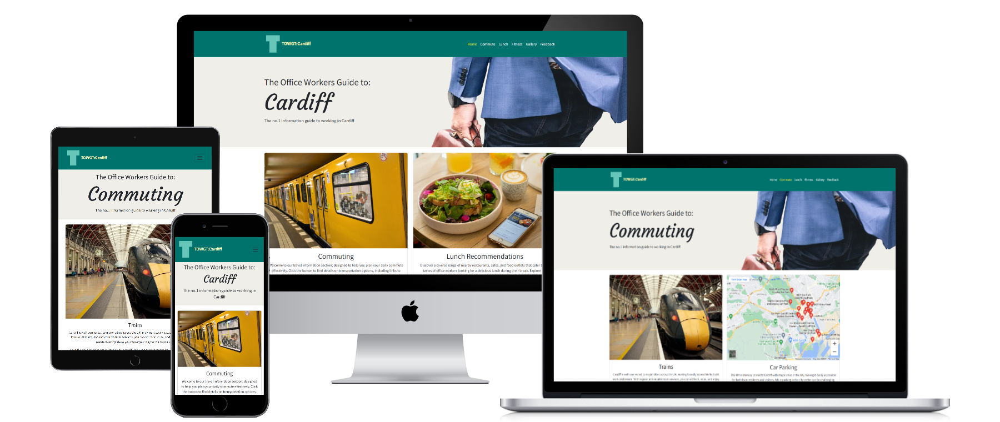
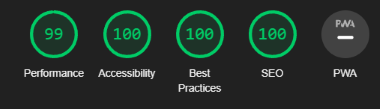
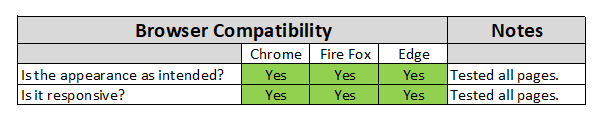

# The Office Workers Guide To: Cardiff - Testing

---
## Contents
- [The Office Workers Guide To: Cardiff - Testing](#the-office-workers-guide-to-cardiff---testing)
  - [Contents](#contents)
  - [Responsiveness](#responsiveness)
    - [Mobile Screenshots](#mobile-screenshots)
    - [Tablet Screenshots](#tablet-screenshots)
    - [Desktop Screenshots](#desktop-screenshots)
    - [Summary](#summary)
  - [Automated Testing](#automated-testing)
    - [W3C Validator](#w3c-validator)
    - [Validation Summary](#validation-summary)
    - [Lighthouse](#lighthouse)
  - [Browser Compatibility](#browser-compatibility)
  - [Manual Testing](#manual-testing)
    - [Testing User Stories](#testing-user-stories)
      - [New User](#new-user)
      - [Returning User](#returning-user)
    - [Full Testing](#full-testing)
      - [Internal](#internal)
      - [External](#external)
  - [Bugs](#bugs)
    - [Solved Bugs](#solved-bugs)
    - [Known Bugs](#known-bugs)
---
## Responsiveness
### Mobile Screenshots

### Tablet Screenshots

### Desktop Screenshots

### Summary

---
## Automated Testing
### W3C Validator
[Home Page Validation](/resources/testing/validations/index-validation.png)\
[Commute Page Validation](/resources/testing/validations/commute-validation.png)\
[Lunch Page Validation](/resources/testing/validations/lunch-validation.png)\
[Fitness Page Validation](/resources/testing/validations/fittness-validation.png)\
[Gallery Page Validation](/resources/testing/validations/gallery-validation.png)\
[Feedback Page Validation](/resources/testing/validations/feedback-validation.png)\
[Thank You Page Validation](/resources/testing/validations/thank-you-validation.png)\
[404 Page Validation](/resources/testing/validations/error-validation.png)\
[CSS Validation](/resources/testing/validations/css-validation.png)
### Validation Summary

---
### Lighthouse

| Page | Observations |
|:---------- | :--------------- |
| Home Page | In order to address performance issues related to the embedded YouTube video and improve lighthouse testing results, it is recommended to consider using facades. Additional information can be found in the Google documentation, specifically in the section on third-party facades (https://developer.chrome.com/en/docs/lighthouse/performance/third-party-facades/). However, despite attempting to implement the recommended solution, I encountered difficulties in getting the video to render correctly. As a result, I have decided to stick with the original embedded code, which renders correctly and remains responsive.  |
| Gallery Page | During the initial testing of the gallery page, a performance score of 74 was obtained. Upon analysing the results, it became evident that the issue was with the large size of the images used. To address this, I obtained smaller versions of the same images and applied compression to reduce their file sizes. Subsequently, the original images were removed and replaced with the new, optimized ones. Upon retesting the page, the performance score significantly improved to 99. |

---
## Browser Compatibility

---
## Manual Testing
### Testing User Stories
#### New User
| Goals | How they are achieved |
| :-----| :--------------------:|
| I want a website that is clear and well organized. |  |
| I want all aspects of the website to be fully functional. |  |
| I want to find out which mode of transport is suitable for me. |  |
| I want to find out what the city looks like. |  |
| I want to be able to find information about other facilities in the city. |  |
| I would like to advertise on the website. |  |
#### Returning User
| Goals | How they are achieved |
| :---- | :--------------------:|
| I want to be able to find alternative modes of transport should my usual mode not be available. | |
| I want to find new places to take lunch. |  |
| I would like the information supplied to be accurate with an option to feedback any incorrect information. |  |
| I would like to be able to quickly navigate through the website. |  |
### Full Testing
#### Internal
| Feature | Expected Outcome | Testing Performed | Result | Pass/Fail |
| :-----: | :--------------: | :---------------: | :----: | :-------: |
| **_Navbar_** |
| Logo | When clicked the user will be redirected to the home page.|Clicked Logo on all pages. | Redirected to the home page. | Pass |
| Home Link | When clicked the user will be redirected to the home page. | Clicked link on all pages. | Redirected to the home page. | Pass |
| Commute Link | When clicked the user will be redirected to the commute page. | Clicked link on all pages. | Redirected to the commute page. | Pass |
| Lunch Link | When clicked the user will be redirected to the lunch page. | Clicked link on all pages. | Redirected to the lunch page. | Pass |
| Fitness Link | When clicked the user will be redirected to the fitness page. | Clicked link on all pages. | Redirected to the fitness page. | Pass |
| Gallery Link| When clicked the user will be redirected to the gallery page. | Clicked link on all pages. | Redirected to the gallery page. | Pass |
| Feedback Link| When clicked the user will be redirected to the feedback page. | Clicked link on all pages. | Redirected to the feedback page. | Pass |
|**_Footer_** | 
| Home Link | When clicked the user will be redirected to the home page. | Clicked link on all pages. | Redirected to the feedback page. | Pass |
| Commute Link | When clicked the user will be redirected to the commute page. | Clicked link on all pages. | Redirected to the commute page. | Pass |
| Lunch Link | When clicked the user will be redirected to the lunch page. | Clicked link on all pages. | Redirected to the lunch page. | Pass |
| Fitness Link | When clicked the user will be redirected to the fitness page. | Clicked link on all pages. | Redirected to the fitness page. | Pass |
| Gallery Link | When clicked the user will be redirected to the gallery page. | Clicked link on all pages. | Redirected to the gallery page. | Pass |
| Feedback Link | When clicked the user will be redirected to the feedback page. | Clicked link on all pages. | Redirected to the feedback page. | Pass |
|**_Home_**| 
| Commute Link |  When clicked the user will be redirected to the commute page. | Clicked link on home page. | Redirected to the commute page. | Pass |
| Lunch Link | When clicked the user will be redirected to the lunch page. | Clicked link on home page. | Redirected to the  lunch page. | Pass |
| Fitness Link | When clicked the user will be redirected to the fitness page. | Clicked link on home page. | Redirected to the fitness page. | Pass |
| Gallery Link | When clicked the user will be redirected to the gallery page. | Clicked link on home page. | Redirected to the gallery page. | Pass |
| Feedback Link | When clicked the user will be redirected to the feedback page. | Clicked link on home page. | Redirected to the feedback page. | Pass |
|**_Feedback_** |
| Submit Button |  When clicked the user will be redirected to the thank you page. | Clicked the submit button. | Redirected to the thank you page. | Pass |
|**_Thank You_** |
| Home page redirection. |  When the thank you page is displayed the user will automatically be redirected to the home page after 30 seconds. | Displayed thank you page. | Redirected to home page after 30 seconds. | Pass |

#### External
| Feature | Expected Outcome | Testing Performed | Result | Pass/Fail |
| :-----: | :--------------: | :---------------: | :----: | :-------: |
|**_Home_** |
| YouTube Video | When clicked the video will start to play. | Clicked the YouTube play button. | Video started playing. | Pass |
|**_Commute_** |
| TFW Website x3 | When clicked the user will be redirected to the TFW website in a new tab. |  Clicked the TFW link. | TFW website opens in a new tab. | Pass |
| Embedded Google Maps| The user is able to interact with the map using the zoom controls and by clicking on the map. | Clicked zoom controls and and various locations on the map. | Map zoomed in and out, clicked locations showed further information. | Pass | 
| Google Maps Link | When clicked the user will be redirected to the google maps website in a new tab. | Clicked the google maps link. | google maps website opens in a new tab. | Pass |
| Cardiff Council Link | When clicked the user will be redirected to the Cardiff council website in a new tab. | Clicked the Cardiff council link. | Cardiff council website opens in a new tab. | Pass |
| Cardiff Bus Link | When clicked the user will be redirected to the Cardiff bus website in a new tab. | Clicked the Cardiff bus link. | Cardiff bus website opens in a new tab. | Pass |
| OVO Bikes Link | When clicked the user will be redirected to the OVO Bikes website in a new tab. | Clicked the OVO Bikes link. | OVO Bikes website opens in a new tab. | Pass |
|**_Lunch_** |
| Pasture Link | When clicked the user will be redirected to the Pasture website in a new tab. | Clicked the Pasture link. |Pasture website opens in a new tab. | Pass |
| Grazing Shed Link | When clicked the user will be redirected to the Grazing Shed website in a new tab. | Clicked the Grazing Shed link. | The Grazing Shed website opens in a new tab. | Pass |
| Las Iguanas Link | When clicked the user will be redirected to the Las Iguanas website in a new tab. | Clicked the Las Iguanas link. | Las Iguanas website opens in a new tab. | Pass |
| Cosy Club Link | When clicked the user will be redirected to the Cosy Club website in a new tab. | Clicked the Cozy Club link. | Cozy Club website opens in a new tab. | Pass |
| Bombers Link | When clicked the user will be redirected to the Bombers website in a new tab. | Clicked the Bombers link. | Bombers website opens in a new tab. | Pass |
| 200 Degrees Link | When clicked the user will be redirected to the 200 Degrees website in a new tab. | Clicked the 200 Degrees link. | 200 Degrees website opens in a new tab. | Pass |
| New York Deli Link | When clicked the user will be redirected to the New York Deli website in a new tab. | Clicked the New York Deli link. | New York Deli website opens in a new tab. | Pass |
| Uncommon Ground Link | When clicked the user will be redirected to the Uncommon Ground website in a new tab. | Clicked the Uncommon Ground link. | Uncommon Ground website opens in a new tab. | Pass |
|**_Fitness_** |
| PureGym Link | When clicked the user will be redirected to the PureGym website in a new tab. | Clicked the PureGym link. | PureGym website opens in a new tab. | Pass |
| The Gym Group Link | When clicked the user will be redirected to the Gym Group website in a new tab. | Clicked the Gym Group link. | The Gym Group website opens in a new tab. | Pass |

---
## Bugs
### Solved Bugs
| Bug | Solution |
|:----| :------: |
|Colors not changing from Bootstrap default colors with class attribute| Change the Color at the property value root level in CSS. |
|Initially, the footer was positioned at the bottom of the thank you page using the position: fixed property with left: 0 and bottom: 0. However, during mobile testing, it was observed that the footer overlapped the thank you text, causing visibility issues. | To address the issue of the footer overlapping content on mobile devices, the Bootstrap documentation provided a solution using the flex classes. |
|The placeholder text assigned to a textarea element is not being displayed within the textarea box.| Due to Prettier formatting, the newline character between the opening and closing tags causes the placeholder text to be affected, resulting in an undesired line break.To resolve this issue, the textarea and all of its attributes are placed on the same line in the code.

### Known Bugs

